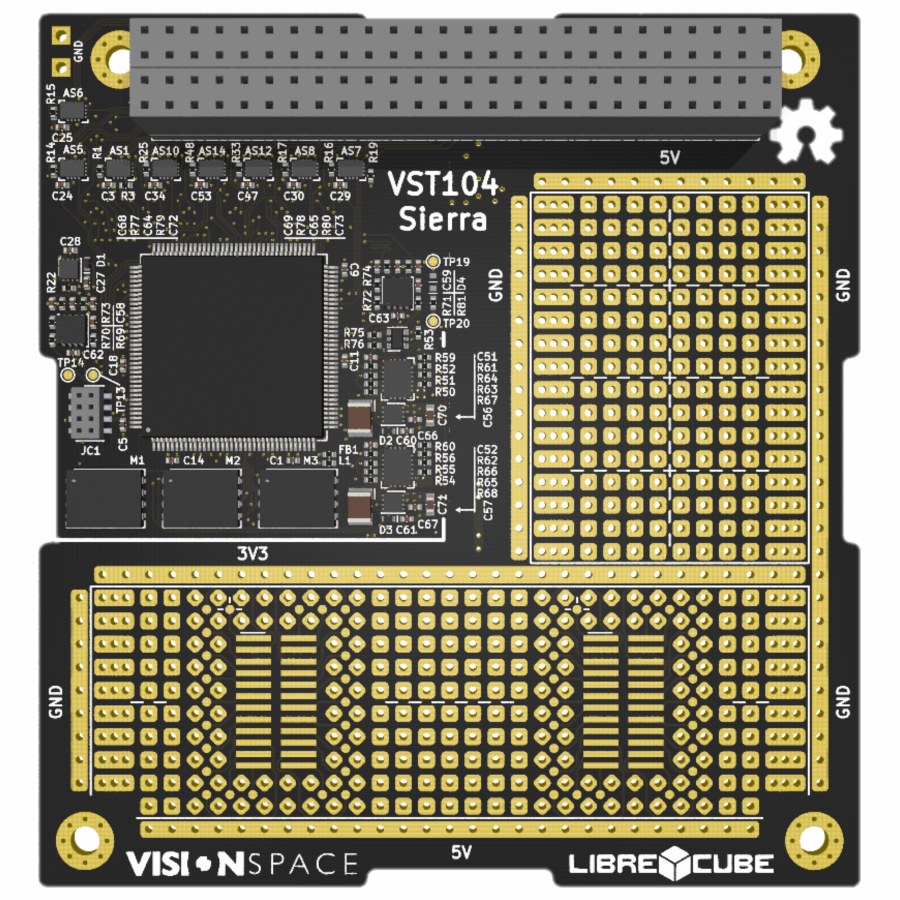
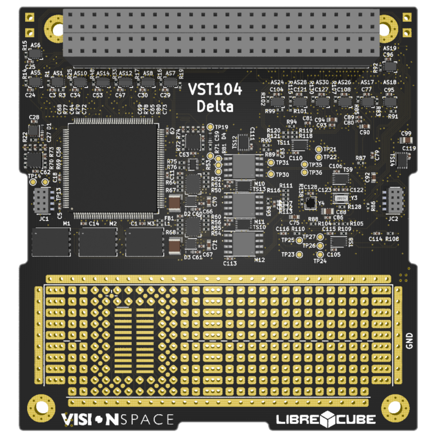
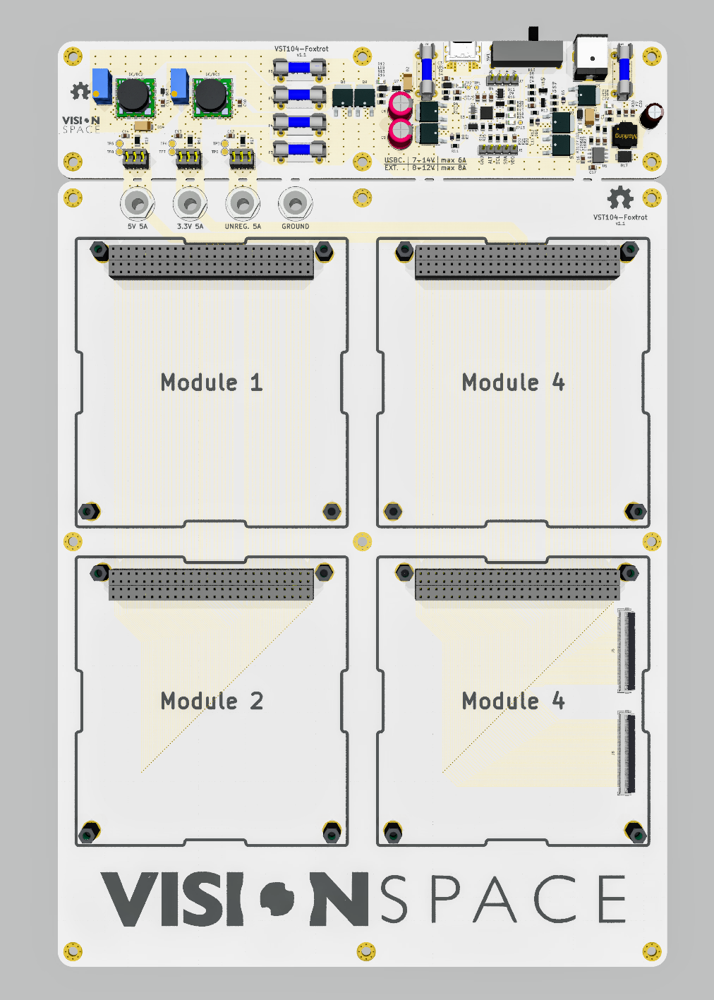

# VST104 - Vision Space Tech. PC104 boards
This repository contains all of the PCB boards designed by the company [Vision Space Technologies](https://www.visionspace.com/) as a contribution to an open-source space and earth exploration project [LibreCube](https://librecube.org/). 

## Boards
All of the boards are designed with [KiCad software](https://kicad-pcb.org/) and follow the normative specifications of LibreCube boards in PC104 format defined [at this link](https://wiki.librecube.org/index.php?title=LibreCube_Board_Specification). It includes information about the board layout, stacking, components, and other essential parameters. All used components of the OBC boards are suitable for space applications as they meet: i). Mechanical failure qualifications AEC-Q100 or AEC-Q200; ii). Military rated operational temperatures (-40°C to +125°C).

The following boards have been developed or are currently under development:

- ### VST104 prototype board - referred as [board_zero](./board_zero) 
This board is designed to be connected to other LibreCube boards for hardware and software testing and development. The main working area contains a universal THT soldering array and two SO-24 footprints with extended pads. The board should provide an efficient tool for soldering temporary circuits with THT technology (plus the two SMD chips).
 

- ### VST104 single OBC board - referred as [board_sierra](./board_sierra) 
This board hosts a single redundant onboard computer designed to fulfill space industry requirements. The main processing unit is STM32L496 microprocessor with access to triple redundant FLASH and F-RAM memories, two CAN-BUS drivers, high and low-speed external oscillators, and seven onboard temperature sensors, all together with many protective features. A large universal soldering array with SO-24 footprints fills the unused parts of the board.
 

- ### VST104 double OBC board - referred as [board_delta](./board_delta) 
This board combines two [sierra boards](./board_delta) in parallel design prowiding a doble redundancy. User is capable of running the very same code on both of the OBCs (as they have consistent layout) and switching inbetween them with dedicadet kill-switches. Universal soldering array with SO-24 footprints fills the unused lower part of the board.
 

- ### VST104 Flat-Sat board - referred as [element_foxtrot](./element_foxtrot) 
This auxiliary VST board serves as a flat-sat developement board.  It is capable of hosting four modules with possibility of extention to other flat-sat thru FPC cable. Breakable part on the top serves as external power management circuitry with 2[mm] power plug or USB-C connector. 
 

## Software
Only a basic  C++ software dedicated to the test of correct board assembly is available sofar [at this repository](https://github.com/visionspacetec/VST104-Testing).

## Libraries
All of the previously stated boards of this project share these KiCad libraries. These libraries are located outside individual boards project files. As there is no library management included in KiCad, the user is required to change hardcoded library paths manually.
| Library | Description |
| :-: | :-- |
| [`VST104_libraries`](./VST_libraries)  | Just a few new symbols were required so far. All of them are listed in this symbol library. |
| [`VST104_footprints`](./VST_footprints.pretty) |  This library contains all of the created or modified footprints. A special subfolder contains 3D models of some of the used components. The standard silk line width is 0.16[mm]. |
| [`VST104_logos`](./VST_logos.pretty) |  All of the used silk layer logos and special characters are placed in this library. |

## Plugins
During development and other works on this project, the following external KiCad plugins were used:
| Plugin | Description |
| :-: | :-- |
| [`Interactive HTML BOM`](https://github.com/openscopeproject/InteractiveHtmlBom) | "Tool designed to assist with hand assembling PCBs. Output is viewable in any modern browser and allows users to easily highlight a specific reference or all components in a group on a visual rendering of PCB. Script works both as Pcbnew action plugin and as a command-line tool."  |
| [`Teardrops`](https://github.com/NilujePerchut/kicad_scripts/tree/master/teardrops) | "A GUI to teardrop the vias, pads and "T" tracks connections in the Pcbnew." |
| [`Replicate layout`](https://github.com/MitjaNemec/Kicad_action_plugins) | "This Kicad Action plugin replicates layout section. The replication is based upon hiThe basilical sheets. The basic requirement for replication is that the section for replication is completely contained within one hierarchical sheet, and replicated sections are just a copy of the same sheet." |
| [`RF-Tools for KiCAD`](https://github.com/easyw/RF-toolsPCBCAD) | "A Kicad Action plugin suite to mitered RF and Flex PCB design. Footprint wizards for designing mitered bends, tapered track connectors, and arc tracks (radius bends) for RF layout, included. Round track corners routing, PCB length measurement, and a mask expansion tool for direct PCB routing. Via fencing tool for RF via shielding." |
