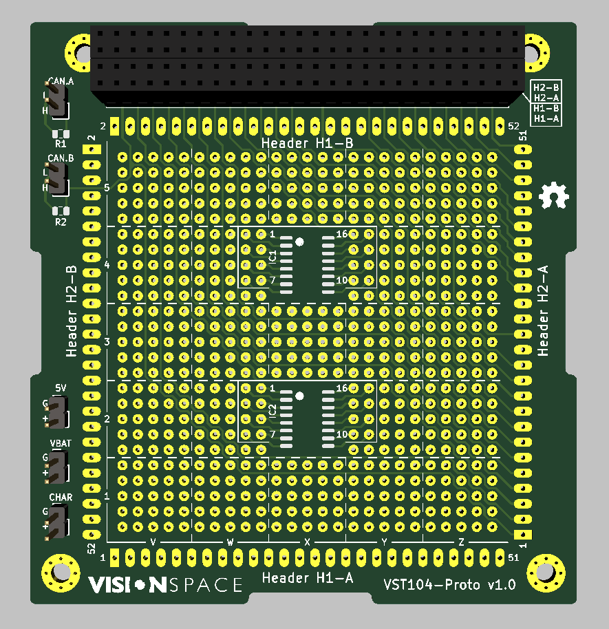
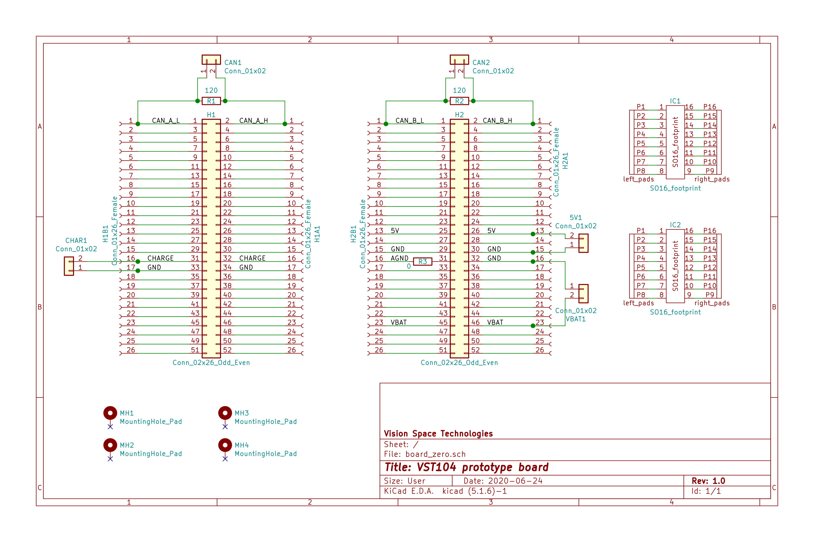

# VST104 prototype board
This repository contains a KiCad project of a prototype board designed for a CubeSat development. The board follows the normative specifications of LibreCube boards in PC104 format defined [at this link](https://wiki.librecube.org/index.php?title=LibreCube_Board_Specification). It includes information about the board layout, stacking, components, and other essential parameters.

It is meant to use this board with a connection to other LibreCube boards for hardware and software testing and development.  This board should provide an efficient tool for soldering temporary circuits with THT technology (plus two SO16 chips).

## Usage
After opening the project in a KiCad, it is necessary to import the required libraries. These are provided [in the main VST104 repository](https://github.com/visionspacetec/VST104) as *VST_libraries*, *VST_footprints.pretty*, and *VST_logos.pretty*. We recommend to clone them into a local file system and then to link them into the KiCad project using the library management window.

## Visual teaser
 

## Board layout
- **soldering array** - A significant part of the board contains a universal soldering array of 2.54[mm] spacing. With dimensions of 25x25 THT pads, it provides sufficient space for any hardware testing or simple development. The array is divided into blocks of 5x5 pads by dashed lines and labeled in a coordinate system (1-5; V-Z) for a better orientation. We have designed the pads in a circular shape with a 0.71[mm] hole and a diameter of 1.685[mm] to increase its robustness.
- **SO16 footprints** - Two universal SO16 package SMD footprints are located in the central part of the soldering array (marked as IC1 and IC2).  Their SMD pads are connected to nearby THT pads for an easier soldering. A small dot marks the orientation of the SO16 chip, and numerals shows its corresponding THT pads.
- **headers** - We added extensions of the standard CubeSat headers around the soldering array to simplify the wire management during the board usage. The extensions are labeled accordingly to a LibreCube standard as H1-A to H2-B. A quick reminder of this layout is shown in a diagram on the top right corner of the board. The pinout numbering is marked for the first and last pin of the header accordingly to the LibreCube standard.
- **connectors** - For an easier aces to shared signals, a couple of two-pin THT connectors (female or male) are located on the left side of the board. The signals are namely both of the CAN bus lines (CAN.A and CAN.B),  a main bus power (5V), a direct battery output (VBAT), and a battery charge input (CHAR). The following symbols mark the polarity of these connectors: 'L' low, 'H' high, '+' positive voltage, 'G' ground.
- **terminating resistors** - Two resistors (R1 and R2) are placed near the CAN bus connectors. Their present is required accordingly to the standard application of the CAN bus. The used SMD package is 0805 (in metrics).

## Board parameters
- **layers** - Because of the placement of the headers around the soldering array, we decided to use a 4-layer PCB. The first three layers from the top are used for standard signals. The bottom layer is used for wider power traces and as a common ground. This layer creates a grounded polygon as a way of a standard PCB shielding.
- **traces** - The common width of a copper trace is 0.35[mm] for standard signals and 0.7[mm] for power traces such as VBAT, CHARGE, and 5V.
- **silk print** - The minimal width of a silk line is to 0.2[mm], and the minimal size of a silk letter is to 1x1[mm].
- **vias** - On the whole PCB, there is just a one via used. Its position is at the trace of the analog ground signal near the resistor R3.

## Notice
- This development board is not suitable for usage with sensitive analog signals or phenomenally high-frequency signals. The sandwiched nets of traces could create a potential interference. Thus, a jumper resistor R3 is added in series to the analog ground pin (marked as AGND) at the header H2 (pin 31). Thanks to its placement as near to the header as possible, a user of our board can activate/deactivate the whole AGND trace by connecting/disconnecting this jumper. 
- This board passed a DRC check with three courtyards overlap warnings. This issue is known and formed by the small gap between the mounting holes and the headers of the standardized layout.
